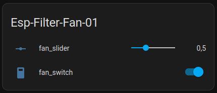

Esphome esp8266 implementation for TOSHIBA CAF-X33XPL. Implemented on/off switch, and speed changer switch.  

Implemented as `template number` and as `fan` components.

  
[esp-filter-fan-01_slider.yaml](./esp-filter-fan-01_slider.yaml)  

  
[esp-filter-fan-01_fan.yaml](./esp-filter-fan-01_fan.yaml)  
